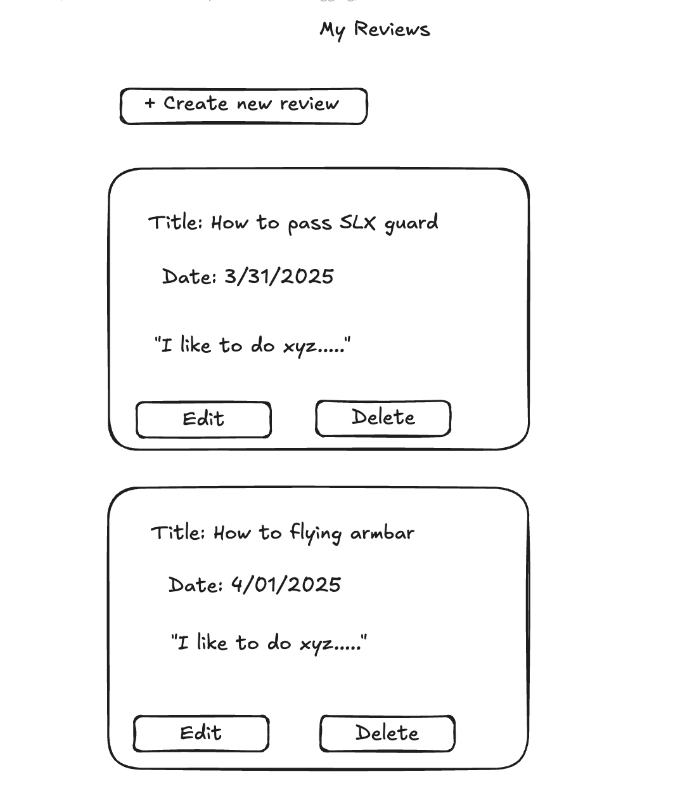

#  BJJ Instructionals – Full-Stack Web App

---

## App Description

**BJJ Instructionals** is a full-stack web application built using the MEN stack (MongoDB, Express, Node.js) with EJS templates. The app allows users to browse BJJ instructionals, add them to a shopping cart, and "purchase" them to store in a personal video library. Additionally, users can write blog-style reviews to recommend instructionals and view posts written by the community.

This app is inspired by training platforms like **BJJ Fanatics** and built to showcase core full-stack skills, including:

- Session-based authentication
- CRUD functionality
- User authorization
- RESTful routing
- Database relationships
- Clean UI/UX design

---

## Routes & Button Actions

This image summarizes all primary navigation routes, HTTP methods, and access control in the app.

## Wireframes & ERD Planning

The wireframes and ERD were created using Excalidraw to plan key user flows and UI pages for the BJJ Instructionals app.

---

### Full Wireframe Overview  

---

### Login Page  

---

### Sign Up Page  

---

### Home Page  

---

### Profile Page  

---

### Cart Page  

---

### Reviews Page  

---

### Instructionals Page  

---

### Community Reviews  

## Entity Relationship Diagrams (ERD)

These diagrams show the models and relationships for the BJJ Instructionals app.

---

### User Model  

---

### Post Model  

---

### Instructional Model  

---

### Full App ERD Overview  

##  Technologies Used

- **Node.js** – Backend runtime
- **Express.js** – Server and routing
- **MongoDB + Mongoose** – Database
- **EJS** – Template rendering
- **CSS / Flexbox** – Layout and design
- **Render** – For deployment
- **ChatGPT** – Helper
- **Lucid** – ERD Diagram
- **Excalidraw** – Wireframe Diagram

---

## MVP Features

- User registration and login
- View a list of BJJ instructionals
- Favorite/unfavorite instructionals
- View favorites in the user's profile
- Create blog-style posts (reviews)
- Edit and delete reviews
- View all reviews posted by the community

---

## MVP User Stories

- Register and log in to access personalized features.
- Browse all available instructionals.
- Add instructionals to a cart for later purchase.
- "Purchase" instructionals and view them in a personal library.
- Create reviews recommending instructionals to others.
- Read reviews posted by the community.
- Edit or delete reviews created by the logged-in user only.

---

## Stretch Goals

- Shopping cart functionality
- “Purchase” instructionals to save to a library
- Filter/search instructionals by category or instructor
- Upload profile pictures

---